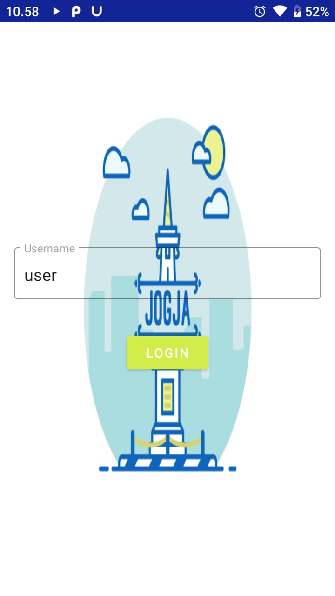
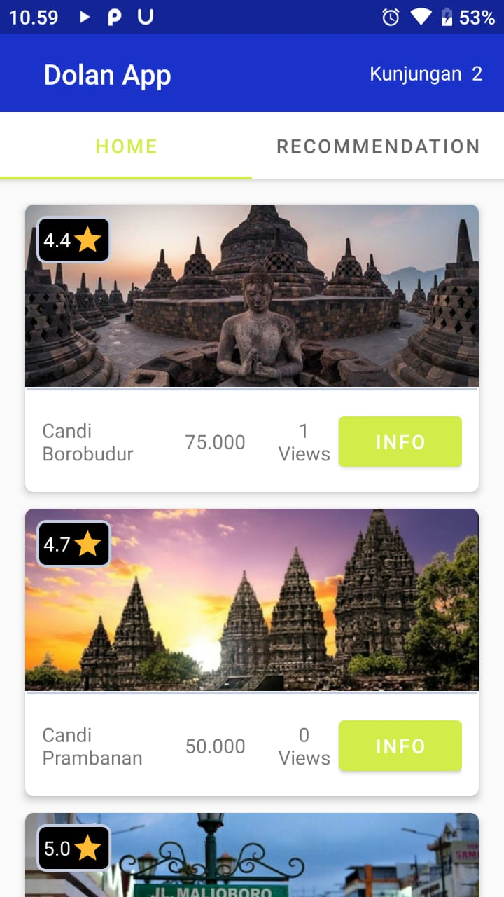
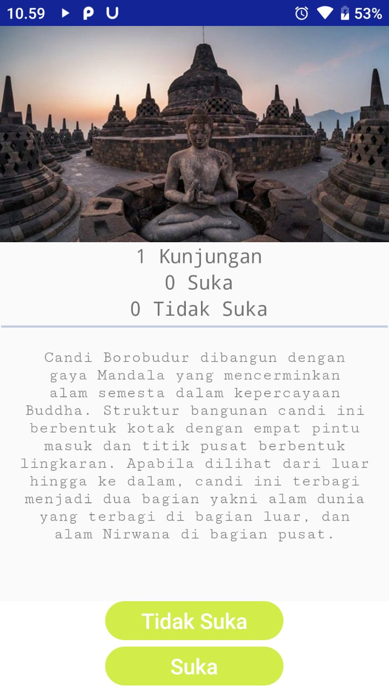

<h1 align="center">Dolan App</h1>

## APK Release
https://drive.google.com/open?id=1HsNaXOls4Icgga6bqmiA5WVrLr-kPyPd

## Screenshots
  

## Problem Statement
1.  Take a sample JSON for a list of Hotels
2.  The destination shall have most basic identifying fields
3.  Create a few users who will perform the following activities.
4.  Track the visitors on a destination page
6.  Users make a "Tidak Suka", where the user tries to dislike a hotel but don't interest destination
7.  Users "Suka" a destination i.e. Create a interest destination
8.  Display the activities happening around hotel page (Kunjungan, Tidak Suka, Suka)
9.  Display recommendations of other destination based on the activities done by the user.
10.  Implement a basic UI with minimal functionality required.

## App Features
1. Shows list of Destination as structured
2. List of hotels shown with their ratings, tags and views.
3. On clicking "Suka"  user can create either Draft or Complete Respone.
4. Activities including Views, Suka, Tidak Suka are displayed to all.

## Recommendation System
Each hotel has tags attached with it. Upon successful booking of the user,
He/she can navigate to the "**Recommendation**" tab to see relevant hotels having similar tags.

